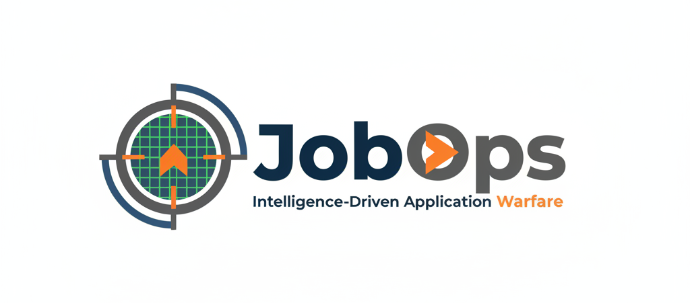
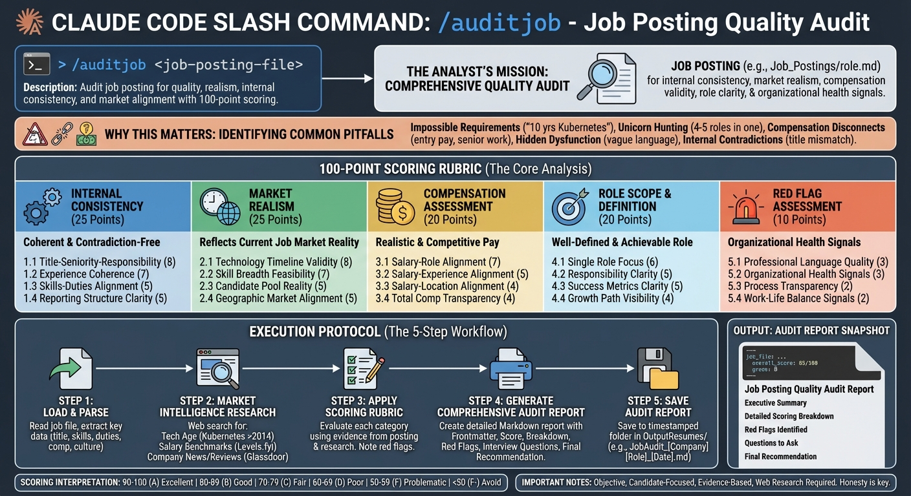
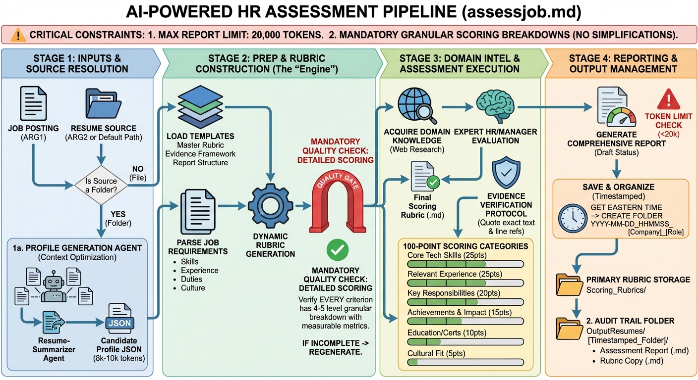
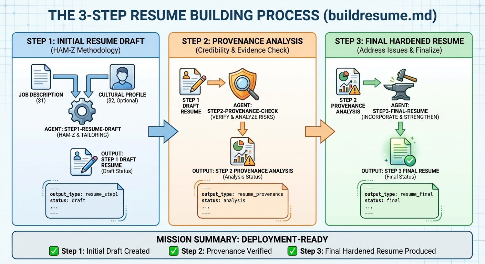
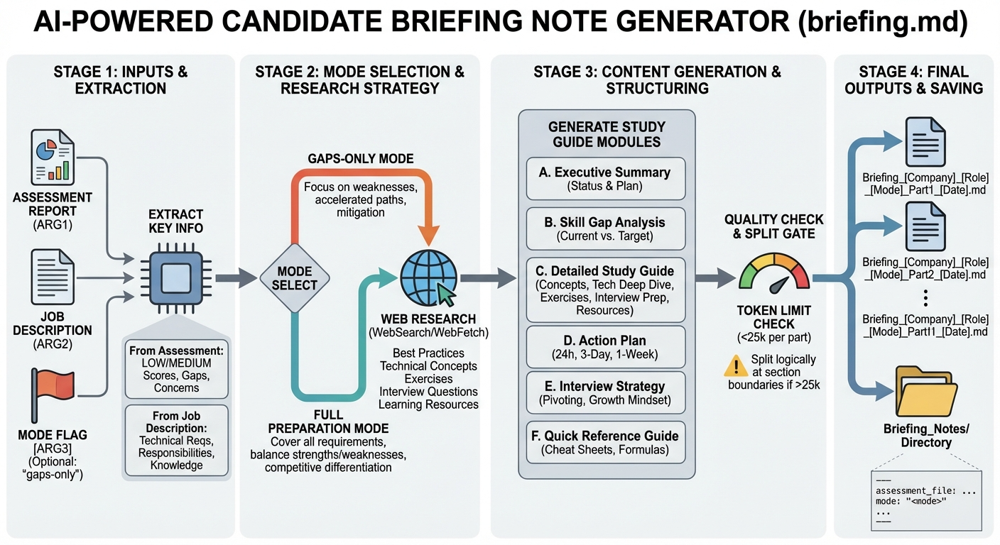
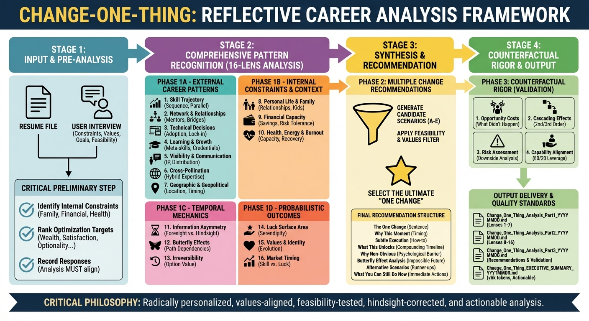

# JobOps - Intelligence-Driven Application Warfare System

<p align="center">
  
</p>

**Version 1.6.1** | [Changelog](CHANGELOG.md) | [Why I Built This](Why_I_Built_This.md)

**Wage war on unemployment.** A tactical job application platform that transforms career inventories into winning applications through systematic opportunity assessment, credible resume development, and strategic interview preparation using an 8-step intelligence-driven methodology.

> *"The system is broken. And everyone knows it. But nobody's fixing it."* — Read the full story in [Why_I_Built_This.md](Why_I_Built_This.md)

## Rapid Deployment Protocol

### Prerequisites

**Required**: Claude Code CLI only
```bash
npm install -g @anthropic-ai/claude-code
```

**Optional** (for `/searchjobs` command only - currently blocked):
- Node.js dependencies: `npm run install-all`
- Playwright MCP server (see `SETUP.md` for configuration details)

### Quick Start

1. **New users**: Run `/create-career-history <your-resume.pdf>` to parse your existing resume and auto-populate your master career inventory with HAM-Z-enhanced content
2. Review and enhance the generated `ResumeSourceFolder/` files, then add target roles to `Job_Postings/`
3. Launch Claude Code in this repository and start with `/assessjob Job_Postings/Example.md` followed by `/buildresume`

**Note**: This is a Claude Code repository. All functionality works through Claude Code slash commands - no additional dependencies required except for the optional job search feature.

## Architecture Overview

- **Claude Code CLI** orchestrates the workflow: users issue slash commands that call specialized agents under `.claude/`
- **Content directories** (`ResumeSourceFolder/`, `Job_Postings/`, `OutputResumes/`, `Briefing_Notes/`) hold source materials, generated analyses, and deliverables
- **HAM-Z agents** execute each step: resume drafting, provenance hardening, and interview preparation
- **Scoring and OSINT resources** in `Scoring_Rubrics/` and `Intelligence_Reports/` feed assessments and research deliverables
- **Playwright MCP server** (optional) provides browser automation for `/searchjobs` command only (currently blocked)

## Tactical Capabilities

JobOps deploys the HAM-Z™ methodology to create powerful, defensible strike packages that are:
- **Strategically positioned** for specific roles
- **Culturally attuned** to regional preferences
- **Provenance-hardened** to withstand scrutiny
- **ATS-optimized** for applicant tracking systems

Deploy a tactical 8-step offensive organized into three phases: strike package assembly (Steps 1-3), interview preparation (Steps 4-6), and mission execution (Steps 7-8), ensuring every claim is verified and every achievement is weaponized with mechanism, metrics, and timeframe.

### Theoretical Foundation: Assessment-First Hiring

This application was designed around the **Assessment-First Hiring Model**, a system dynamics approach that addresses the fundamental inefficiency in modern job markets. The theoretical framework, detailed in [`SourceMaterial/System_Dynamics_Analysis_Assessment_First_Hiring_v3.md`](SourceMaterial/System_Dynamics_Analysis_Assessment_First_Hiring_v3.md), demonstrates how AI-assisted resume embellishment has created a "Vicious Cycle of Embellishment" where:

- 73.4% of job seekers use AI tools to enhance resumes
- Signal-to-noise ratio has degraded to **-2.5 dB** (more noise than signal)
- Employers add screening layers, incentivizing further embellishment

The assessment-first model breaks this cycle by evaluating candidate fit *before* application creation, potentially achieving:
- **35-60% reduction** in misaligned applications
- **30-60% decrease** in time-to-hire
- **40-80% improvement** in overall market matching efficiency
- **+3.2 to +10.4 dB improvement** in signal quality

This theoretical foundation explains why JobOps begins with target reconnaissance (`/assessjob`) rather than immediate resume creation - preventing wasted effort on fundamentally poor targets while ensuring only high-probability opportunities receive full tactical deployment.

## Weapons Systems

- **HAM-Z™ Methodology**: Combines Hard Skills, Actions, Metrics, and Structure with XYZ narrative format to create precision-targeted achievements
- **Provenance Hardening**: Comprehensive credibility verification to identify and eliminate fabricated claims
- **Cultural Profiles**: Adapts resume style to regional theater expectations (Canadian, US, European, etc.)
- **Arsenal Inventory**: Maintains comprehensive career database separate from mission-specific deployments
- **Dynamic Target Scoring**: Creates custom reconnaissance rubrics for each opportunity
- **Interview Preparation**: Gap analysis intelligence briefings and tactical rehearsal question generation
- **Distributed OSINT Intelligence**: Professional-grade company reconnaissance with parallel specialized agents
- **Target Acquisition System**: Hybrid search combining API reconnaissance + Playwright deep-scan for complete intelligence

## Arsenal Organization

```
resumeoptimizer/
├── .claude/                           # Claude Code configuration
│   ├── agents/                        # 16 specialized processing agents (categorized)
│   │   ├── resume-development/        # Core resume creation agents
│   │   │   ├── step1-resume-draft.md     # Initial tailored resume
│   │   │   ├── step2-provenance-check.md # Credibility verification
│   │   │   ├── step3-final-resume.md     # Hardened final resume
│   │   │   └── step4-cover-letter.md     # Strategic cover letter
│   │   ├── interview-prep/            # Assessment & preparation agents
│   │   │   ├── candidate-assessment.md    # HR-level job fit assessment
│   │   │   ├── interview-briefing.md     # Study guide and gap analysis
│   │   │   └── interview-question-generator.md # Custom interview questions
│   │   ├── job-search/                # Job discovery agents
│   │   │   └── hiringcafe-search.md      # Job search via hiring.cafe API
│   │   ├── osint/                     # Intelligence gathering agents
│   │   │   ├── osint-agent.md            # Master OSINT orchestrator
│   │   │   ├── osint-compensation.md     # Salary and benefits intelligence
│   │   │   ├── osint-corporate.md        # Company structure and financials
│   │   │   ├── osint-culture.md          # Workplace culture analysis
│   │   │   ├── osint-leadership.md       # Executive background checks
│   │   │   ├── osint-legal.md            # Litigation and compliance
│   │   │   └── osint-market.md           # Industry and competition
│   │   ├── performance/               # Optimization agents
│   │   │   └── resume-summarizer.md      # Candidate profile optimization (v1.1.1+)
│   │   └── landing-page/              # Landing page development (v1.5.2)
│   │       └── landing-page-copywriter.md # Strategic copywriting agent
│   ├── commands/                      # Slash command definitions (categorized)
│   │   ├── resume-development/        # Core resume creation
│   │   │   ├── buildresume.md        # /buildresume - 3-step resume process
│   │   │   └── provenance-check.md   # /provenance-check - Standalone verification
│   │   ├── interview-prep/            # Assessment & preparation
│   │   │   ├── assesscandidate.md    # /assesscandidate - Use pre-created rubric
│   │   │   ├── assessjob.md          # /assessjob - Complete assessment
│   │   │   ├── briefing.md           # /briefing - Interview prep guide
│   │   │   ├── comparejobs.md        # /comparejobs - Multi-job analysis
│   │   │   ├── createrubric.md       # /createrubric - Rubric only
│   │   │   └── interviewprep.md      # /interviewprep - Question generator
│   │   ├── application-finalization/  # Final documents
│   │   │   ├── convert-to-word.md         # /convert - Markdown to DOCX
│   │   │   ├── convert-to-pdf-playwright.md # /formatresume - Professional PDF with Playwright (v1.4.0)
│   │   │   └── markdown-to-pdf.md         # /pdf - Markdown to PDF
│   │   ├── job-search/                # Discovery & intelligence
│   │   │   ├── auditjobposting.md    # /auditjobposting - Job posting quality audit (v1.3.0)
│   │   │   ├── osint.md              # /osint - Company intelligence
│   │   │   └── searchjobs.md         # /searchjobs - hiring.cafe search
│   │   ├── system-setup/              # Configuration & utilities
│   │   │   ├── create-career-history.md  # /create-career-history - Setup wizard
│   │   │   ├── git-delete.md         # /git-delete - Delete git history
│   │   │   ├── github-portfolio.md   # /github-portfolio - Portfolio documentation
│   │   │   └── install-pandoc.md     # /install-pandoc - Setup converter
│   │   ├── career-strategy/           # Long-term planning
│   │   │   ├── change-one-thing.md   # /change-one-thing - Career retrospective
│   │   │   └── idealjob.md           # /idealjob - Synthetic ideal job generator (v1.4.0)
│   │   ├── independent-contractor/    # B2B business development (v1.5.0)
│   │   │   ├── defineservices.md     # /defineservices - Service offerings
│   │   │   ├── findclient.md         # /findclient - Client discovery
│   │   │   ├── ratecard.md           # /ratecard - Rate card generation
│   │   │   ├── pitchdeck.md          # /pitchdeck - Pitch deck creation
│   │   │   └── proposaltemplate.md   # /proposaltemplate - Proposal generation
│   │   ├── career-crisis/             # Employment crisis management (v1.6.0)
│   │   │   ├── code-red.md           # /code-red - Master crisis intervention
│   │   │   ├── severance-review.md   # /severance-review - Package analysis
│   │   │   ├── workplace-documentation.md # /workplace-documentation - Incident logging
│   │   │   ├── non-compete-analysis.md    # /non-compete-analysis - Covenant review
│   │   │   ├── reference-shield.md   # /reference-shield - Reference management
│   │   │   ├── unemployment-prep.md  # /unemployment-prep - UI claim preparation
│   │   │   ├── discrimination-assessment.md # /discrimination-assessment - Pattern analysis
│   │   │   ├── investigation-prep.md # /investigation-prep - Investigation readiness
│   │   │   ├── accommodation-request.md   # /accommodation-request - ADA/religious
│   │   │   ├── layoff-intel.md       # /layoff-intel - Early warning system
│   │   │   └── constructive-dismissal.md  # /constructive-dismissal - CD assessment
│   │   └── landing-page/              # Landing page development (v1.5.2)
│   │       ├── create.md             # /landing-page:create - Build landing pages
│   │       ├── css-template.md       # /landing-page:css-template - CSS management
│   │       ├── copywrite.md          # /landing-page:copywrite - Strategic copy
│   │       └── copywriting-spec.md   # /landing-page:copywriting-spec - Brand spec generator
│   ├── templates/                     # Assessment framework templates (v1.1.1+)
│   │   ├── assessment_report_structure.md    # Report format template
│   │   ├── assessment_rubric_framework.md    # 100-point rubric structure
│   │   ├── candidate_profile_schema.json     # Profile JSON schema
│   │   ├── evidence_verification_framework.md # Evidence protocols
│   │   └── service_definition_schema.json    # B2B service definition schema (v1.5.0)
│   ├── styles/                        # CSS styling for PDF generation (v1.4.0)
│   │   ├── resume-base.css            # Base print/PDF styles
│   │   ├── obsidian.css               # Obsidian-style PDF formatting
│   │   └── resume-themes/             # Theme-specific styles
│   │       ├── modern.css             # Contemporary blue accent design
│   │       ├── classic.css            # Traditional serif formal styling
│   │       └── minimal.css            # Ultra-clean whitespace design
│   └── settings.local.json            # Local Claude Code settings
├── .playwright-mcp/                   # Playwright browser automation cache
├── Briefing_Notes/                    # Interview preparation materials
│   └── Briefing_*_*_*_*.md           # Gap analysis and study guides
├── Client_Prospects/                  # Independent contractor outputs (v1.5.0)
│   ├── Service_Definition_*.md       # B2B service offerings
│   ├── Prospects_*_*.md              # Client discovery results
│   ├── Rate_Card_*.*                 # Professional rate cards
│   ├── Pitch_*_*.md                  # B2B pitch decks
│   └── Proposal_*_*_*.md             # Consulting proposals
├── Guides/                            # Templates and metadata standards
│   ├── CareerHighlight_Template.md    # CareerHighlights file template
│   ├── Experience_Template.md         # Experience file template
│   ├── TechnologyMatrix_Template.md   # Technology capability template
│   ├── Metadata_Standards.md          # YAML frontmatter standards
│   ├── Maintenance_Checklist.md       # Master resume maintenance guide
│   └── Migration_Tracker.md           # Migration status tracker
├── Images/                            # Branding assets
│   └── JobOps_logo.png               # Repository logo
├── Intelligence_Reports/              # OSINT company intelligence reports
│   ├── [Company]_*_Intelligence_*.md  # Specialized intelligence reports
│   └── [Company]_Master_Intelligence_*.md # Consolidated reports
├── Job_Postings/                      # Job descriptions and search results
│   ├── [Company]_[Role]*.md          # Manual job postings
│   ├── IdealJob_Synthetic_[Date].md  # Generated ideal job descriptions (v1.4.0)
│   └── SearchResults_*_*_*.md        # Automated search results with full descriptions
├── OutputResumes/                     # Generated resumes and assessments (v1.1.1+ uses timestamped folders)
│   ├── YYYY-MM-DD_HHMMSS_[Company]_[Role]/  # Timestamped assessment folder (v1.1.1+)
│   │   ├── Assessment_[Company]_[Role]_[Date].md # Job fit assessment with scores
│   │   └── Rubric_[Company]_[Role]_[Date].md     # Scoring rubric (audit trail copy)
│   ├── Briefing_[Company]_[Role]_*_*.md # Interview preparation briefings
│   ├── Change_One_Thing_*_*.md       # Career retrospective analysis parts
│   ├── Comparison_*_*_*.md           # Multi-job comparison reports
│   ├── Interview_Prep_*_*_*.md       # Customized interview questions
│   ├── Step1_Draft_*_*_*.md          # Initial tailored resumes
│   ├── Step2_Provenance_Analysis_*.md # Credibility analysis reports
│   ├── Step3_Final_Resume_*_*_*.md   # Final hardened resumes
│   └── Step4_CoverLetter_*_*_*.md    # Strategic cover letters
├── ResumeSourceFolder/                # Master career inventory (source of truth)
│   ├── .profile/                      # Optimized candidate profile cache (v1.1.1+)
│   │   ├── candidate_profile.json     # Structured profile (85-90% token reduction)
│   │   └── extraction_log.md          # Profile generation metadata
│   ├── CareerHighlights/              # Certifications, skills, activities
│   │   ├── CareerHighlights_Core_Competencies.md
│   │   ├── CareerHighlights_Education_and_Designations.md
│   │   ├── CareerHighlights_Other_Certifications.md
│   │   ├── CareerHighlights_Professional_Activities.md
│   │   ├── CareerHighlights_Professional_Development.md
│   │   └── CareerHighlights_Publications.md
│   ├── Experience/                    # Detailed work history by role
│   │   ├── Experience_YYYY_[Company].md # One file per role
│   │   └── ...
│   ├── Preferences/                   # Job search preferences (v1.2.0+)
│   │   └── Vision.md                  # Vision & Anti-Vision framework
│   └── Technology/                    # Technical capabilities portfolio
│       ├── Comprehensive_CV_Technology_Capability.md
│       └── GitHub_Repositories.md     # Portfolio documentation
├── Sample_Output/                     # Example outputs for reference
│   ├── *_Fit_Assessment_*.md         # Sample assessments (Poor/Moderate/Great)
│   ├── Briefing_*_*_*.md             # Sample briefing notes
│   ├── Interview_Prep_*_*_*.md       # Sample interview preparations
│   └── Rubric_*_*_*.md               # Sample scoring rubrics
├── Scoring_Rubrics/                   # Reusable assessment rubrics
│   └── Rubric_[Company]_[Role]_[Date].md # Job-specific scoring frameworks
├── scripts/                           # Utility scripts
│   └── validate/                      # Validation tools
├── SourceMaterial/                    # Methodology and analysis documents
│   ├── System_Dynamics_Analysis_Assessment_First_Hiring_v3.md # Theoretical foundation
│   └── [various analysis files]       # Development documentation
├── AGENTS.md                          # Agent documentation
├── CHANGELOG.md                       # Version history
├── CLAUDE.md                          # System instructions for Claude Code
├── JOB_SEARCH_GUIDE.md               # Job search workflow documentation
├── LICENSE                            # MIT License
├── Master_Resume_Comprehensive_Setup_Guide_v1.md # Master resume methodology
├── README.md                          # This documentation
├── SETUP.md                          # Setup and installation instructions
├── Why_I_Built_This.md               # Origin story and motivation
├── comprehensive_work_history_FAQ.md  # Master resume philosophy FAQ
└── package.json                       # Node.js dependencies
```

## Tactical Operations Workflow

### 1. Build Your Arsenal Inventory

**The Core Problem**: Traditional 2-page resumes create a critical shortage when deploying AI for tailoring. When you attempt to customize condensed resumes, AI tools must fabricate plausible-sounding but fictional claims, leading to failures under interview scrutiny.

**The Solution**: A comprehensive 20+ page arsenal inventory serves as your "full career database" - every achievement, metric, and skill is documented with complete context. This allows AI to **deploy** verified content rather than **fabricate** it.

**📖 Essential Reading**: Start with [`Master_Resume_Comprehensive_Setup_Guide_v1.md`](Master_Resume_Comprehensive_Setup_Guide_v1.md) for complete methodology and [`comprehensive_work_history_FAQ.md`](comprehensive_work_history_FAQ.md) for quick conceptual explanation.

**🚀 Quick Start for New Users**: If your `ResumeSourceFolder/` is empty, run the intelligent parser with your existing resume:
```bash
/create-career-history path/to/your/resume.pdf
# Or with multiple files:
/create-career-history resume.docx linkedin_export.pdf certifications.txt
```
This parses your resume(s), extracts structured career data, transforms content to HAM-Z format, and creates pre-populated master career inventory files using standardized templates from `Guides/` directory. Provides gap analysis and enhancement recommendations.

Place your comprehensive career inventory in `ResumeSourceFolder/`:
- Complete work history with all projects and achievements using HAMZ-Extended framework
- Technology capabilities and skills inventory with proficiency assessments
- Awards, publications, and certifications with full context and validation

**Critical Standard**: Every claim must withstand interview interrogation with verified examples, metrics, and mechanisms documented.

### 2. Acquire Target Coordinates

**Option A: Manual target upload** (Recommended)
Create a markdown file in `Job_Postings/` directory (e.g., `Job_Postings/CompanyName_Role_Date.md`)

**Option B: Deploy target acquisition sweep** (Currently blocked)
```bash
/searchjobs "your search query" "location" --save
```
Conducts reconnaissance sweep of hiring.cafe and automatically extracts complete verbatim target intelligence to `Job_Postings/` folder. **Note**: Requires Playwright MCP server setup and is currently non-functional.

### 3. Conduct Target Reconnaissance

Before committing strike resources, conduct reconnaissance on target viability:

```bash
/assessjob Job_Postings/AltoJobPost.md
```

Generates comprehensive reconnaissance report showing engagement probability and identifies critical capability gaps. **Only deploy full strike package if reconnaissance shows viable engagement** (typically 60%+ hit probability).

### 4. Assemble Strike Package (If Reconnaissance is Positive)

```bash
/buildresume Job_Postings/AltoJobPost.md Canadian
```

Executes the core 3-step resume assembly: initial draft creation, provenance verification, final hardened resume.

### 5. Prioritize Multiple Targets (If Applicable)

```bash
/comparejobs Assessment_Company1_Role1_Date.md Assessment_Company2_Role2_Date.md
```

### 6. Conduct Interview Preparation

**Generate intelligence brief to address capability gaps:**
```bash
/briefing OutputResumes/YYYY-MM-DD_HHMMSS_[Company]_[Role]/Assessment_[Company]_[Role]_[Date].md Job_Postings/AltoJobPost.md gaps-only
```

**Deploy interview prep questions:**
```bash
/interviewprep OutputResumes/Step3_Final_Resume_[Role]_[Company]_[Date].md Job_Postings/AltoJobPost.md
```

### 7. Execute Final Mission Sequence (Optional)

**Deploy strategic cover letter:**
```bash
/coverletter OutputResumes/Step3_Final_Resume_[Role]_[Company]_[Date].md Job_Postings/AltoJobPost.md
```

**Convert to deployment-ready format:**
```bash
/install-pandoc    # Install pandoc if needed
/convert all       # Convert all documents to Word format
```

## Command Arsenal

### Job Posting Quality Audit
```bash
/auditjobposting <job-posting-file>
```
**START HERE** - Comprehensive 100-point job posting quality assessment to identify red flags before applying. Audit the posting itself before assessing your fit.
- **Internal Consistency (25 pts)**: Title-responsibility alignment, experience coherence, skills-duties match
- **Market Realism (25 pts)**: Technology timeline validity (detects impossible experience requirements), skill breadth feasibility
- **Compensation Assessment (20 pts)**: Salary-role/experience/location alignment with market research
- **Role Scope & Definition (20 pts)**: Single role focus (unicorn detection), responsibility clarity, success metrics
- **Red Flag Assessment (10 pts)**: Language quality, organizational health signals, work-life balance indicators

**Grade Interpretation**: A (90-100) pursue aggressively, B (80-89) worth applying, C (70-79) proceed with caution, D (60-69) poor quality, F (<60) avoid

<p align="center">
  
</p>

### Target Reconnaissance
```bash
/assessjob <job-description-file>
```
Deploys dynamic reconnaissance rubric and 100-point viability assessment with engage/disengage recommendation. Run this *after* the posting passes `/auditjobposting`.

<p align="center">
  
</p>

### Resume Assembly
```bash
/buildresume <job-description-file> [cultural-profile]
```
Executes full 3-step assembly protocol (draft creation, provenance verification, hardened final resume). Theater profiles: Canadian (default), US, European, UK, Australian.

<p align="center">
  
</p>

### Modular Reconnaissance Workflow
```bash
/createrubric <job-posting-file>                              # Establish reusable targeting criteria
/assesscandidate <rubric-file> <job-posting-file>            # Execute standardized reconnaissance
/comparejobs <assessment-1> <assessment-2> [assessment-3]    # Prioritize multiple targets
```

### Interview Preparation
```bash
/briefing <assessment-report> <job-description> [gaps-only]  # Generate intelligence brief
/interviewprep <resume-file> <job-description> [N]           # Deploy interview prep questions
```

<p align="center">
  
</p>

### Target Acquisition System
```bash
/searchjobs <query> [location] [--company=name] [--save] [--limit=N]
```
**Status**: Currently blocked/non-functional. Requires Playwright MCP server configuration (see SETUP.md).

Two-phase hybrid reconnaissance: API sweep + Playwright deep-scan for complete verbatim target intelligence. Default 20 targets, max 50 recommended.

**Examples:**
```bash
/searchjobs "software engineer" "Toronto"
/searchjobs "data analyst" --company=Deloitte --save
/searchjobs "python developer" "Mississauga" --save --limit=30
```

### Intelligence Operations
```bash
/osint <company-name>
```
Deploys 6 specialized intelligence agents in parallel for comprehensive target analysis: Corporate, Legal, Leadership, Compensation, Culture, Market.

### Mission Support
```bash
/provenance <draft-resume-file>                              # Provenance verification sweep
/coverletter <step3-resume> <job-description> [manager]      # Deploy cover letter
/formatresume <markdown-resume> [theme] [pages]              # Professional PDF with Playwright (v1.4.0)
/convert <file-path-or-pattern> [output-directory]           # Convert to deployment format
/install-pandoc [force]                                      # Install conversion utility
```

**`/formatresume` Options** (v1.4.0):
- **Themes**: `modern` (default, blue accents), `classic` (serif, formal), `minimal` (clean, whitespace)
- **Pages**: `1` (entry-level), `2` (mid-career), `3` (executive), `auto` (default, content-based)
- Uses Playwright for pixel-perfect PDF generation with iterative refinement

### Career Strategy & Analysis
```bash
/change-one-thing <resume-folder>
/idealjob [output-filename]                                  # Generate ideal job description (v1.4.0)
/assess-job-offer <offer-document> [--jurisdiction=XX] [--counter-offer]  # Analyze employment offers (v1.6.1)
```

**`/idealjob`** - Generates a synthetic job description representing a near-perfect fit:
- Analyzes complete career inventory and Vision/Anti-Vision preferences
- Studies patterns from high-scoring (90+) assessment reports
- Conducts market research to validate role viability
- Creates realistic job description optimized for candidate strengths
- Provides actionable search strategy with real job titles and target companies

<p align="center">
  
</p>

**`/change-one-thing`** - Conducts comprehensive 16-lens career retrospective analysis to identify the single highest-leverage, non-obvious change you could have made at a specific inflection point. Generates 3-4 detailed analysis parts plus executive summary with:
- External patterns: Skills, network, technical decisions, visibility, cross-pollination, geographic positioning
- Internal constraints: Family, financial capacity, health/energy analysis
- Temporal mechanics: Hindsight bias correction, butterfly effects, irreversibility
- Probabilistic outcomes: Luck vs. skill, values evolution, market timing
- Multi-candidate recommendations optimized for wealth/optionality/impact/balance
- Quantified opportunity costs and risk-adjusted returns
- Actionable "what you can do now" recovery plans with immediate next steps

<p align="center">
  
</p>

**`/assess-job-offer`** (v1.6.1) - Comprehensive employment offer analysis with multi-jurisdiction support:
- **Multi-jurisdiction coverage**: All 13 Canadian provinces/territories + US states with jurisdiction-specific employment standards
- **8-phase analysis**: Document parsing, market research, personal alignment, legal review, red flags, counter-offer, assessment, output
- **Compensation analysis**: Base salary, bonus, equity, benefits valued against market benchmarks via web research
- **Contract term review**: Termination clauses, notice periods, severance, probation, restrictive covenants
- **Legal risk assessment**: Non-competes (enforceability by jurisdiction), IP assignment, NDAs, non-solicitation
- **Personal alignment**: Compares offer against Vision.md goals and Anti-Vision.md deal-breakers
- **Counter-offer generation** (`--counter-offer`): Prioritized negotiation points with specific language and justification
- Default jurisdiction: Ontario, Canada. Override with `--jurisdiction=BC`, `--jurisdiction=CA`, `--jurisdiction=NY`, etc.
- Output: `OutputResumes/JobOfferAnalysis_[Company]_[Date].md`

### Independent Contractor Business Development (v1.5.0)
```bash
/defineservices [--guided|--from-profile|--update]   # Define B2B service offerings
/findclient [--industry=X] [--size=Y] [--limit=N]    # Discover B2B client prospects
/ratecard [--format=md|html|pdf] [--currency=CAD|USD] # Generate professional rate card
/pitchdeck [--prospect=X|--industry=X|--service=X]   # Create B2B pitch deck
/proposaltemplate [--type=project|retainer|staff-aug|workshop] # Generate proposal
```

**`/defineservices`** - Foundation command for defining B2B service offerings with pricing and positioning:
- Three modes: `--guided` (interactive questions), `--from-profile` (auto-generate from candidate profile), `--update` (refresh existing)
- Pricing validation: daily = hourly × 8 (±10%), ascending tiers, JSON schema compliance
- Output: `Client_Prospects/Service_Definition_[Date].md`

**`/findclient`** - B2B client discovery with 10-point prospect scoring:
- 5 weighted factors: Contractor History (25%), Procurement Accessibility (20%), Domain Alignment (25%), Budget Fit (15%), Geographic Match (15%)
- Priority classification: HIGH (8-10, active outreach), MEDIUM (5-7.9, qualified), LOW (1-4.9, deprioritize)
- Entry point identification: vendor portals, warm introductions, decision-makers, intermediaries
- Output: `Client_Prospects/Prospects_[Domain]_[Date].md`

**`/ratecard`** - Professional rate card document generation:
- Pricing validation: daily = hourly × 8, ascending tiers (min < target < premium), premium multiplier 1.3x-2.0x
- Multiple formats: markdown (default), HTML, PDF (via Playwright)
- Optional `--include-justification` for credentials and ROI proof points
- Output: `Client_Prospects/Rate_Card_[Date].[format]`

**`/pitchdeck`** - B2B service pitch deck generation with provenance hardening:
- 12-slide structure: Title, Problem, Cost of Inaction, Solution, How It Works, Results, Why Me, Engagement Options, Experience, Next Steps, Q&A, Appendix
- Provenance hardening: >90% of claims validated against candidate profile with evidence citations
- Three modes: prospect-specific, industry-generic, service-focused
- Output: `Client_Prospects/Pitch_[Target]_[Date].md` (+ optional .pptx via pandoc)

**`/proposaltemplate`** - Professional consulting proposal generation:
- Four engagement types with pricing algorithms: project (fixed-scope), retainer (ongoing), staff-aug (embedded), workshop (training)
- 10-section McKinsey/BCG-style structure with transparent pricing calculation
- Pricing metadata in YAML frontmatter for audit trail
- Output: `Client_Prospects/Proposal_[Client]_[Service]_[Date].md`

### Landing Page Development (v1.5.2)
```bash
/landing-page:create <page-name> [--template=tactical|minimal|corporate]   # Build landing pages
/landing-page:css-template [--view|--analyze|--create] [template-name]     # CSS management
/landing-page:copywrite <page-purpose> [--tone=X] [--framework=X]          # Strategic copy
/landing-page:copywriting-spec [company-name]                               # Brand spec generator
```

**`/landing-page:create`** - Main landing page builder:
- Integrates with `frontend-design:frontend-design` skill for production-grade HTML
- Invokes `landing-page-copywriter` agent for strategic copy development
- Three CSS template options: `tactical` (tech/B2B), `minimal` (creative), `corporate` (enterprise)
- Proven landing page structure: Hero, Problem, Solution, How It Works, Social Proof, CTA
- Mobile-first responsive design with accessibility compliance
- Output: `{output-dir}/{page-name}.html`

**`/landing-page:css-template`** - CSS design system management:
- **View mode**: List available templates and component classes
- **Analyze mode**: Deep-dive into design system variables, components, responsive behavior
- **Create mode**: Generate new CSS templates following established patterns
- Available templates: `tactical` (`docs/subpage-styles.css`), `minimal`, `corporate`

**`/landing-page:copywrite`** - Strategic landing page copywriting:
- Three frameworks: `PAS` (Problem-Agitate-Solution), `AIDA`, `StoryBrand`
- Three tones: `professional` (default), `casual`, `bold`
- Section-by-section copy with A/B test variations
- Persuasion psychology: social proof, authority, scarcity, urgency

**`/landing-page:copywriting-spec`** - Brand copywriting specification generator:
- 8-phase interactive interview: Brand Identity, Target Audience, Voice & Tone, Language Guidelines, Messaging Hierarchy, Proof Points, Competitor Differentiation, Channel Requirements
- Self-contained 20-section document template (no external file dependencies)
- Generates value proposition variants at 10/30/50/75/150 word lengths
- Problem articulation library with approved/avoid language patterns
- Channel-specific guidelines for website, email, LinkedIn, proposals, case studies
- Quality checklist with 20+ validation items for copy review
- Quick-start mode for users with existing brand guidelines
- Output: `Client_Prospects/[CompanyName]_Copywriting_Spec.md`

### Career Crisis Management (v1.6.0)

**Employment Defense Toolkit** - Comprehensive support for navigating workplace crises, from early warning through exit strategy.

```bash
# Master crisis intervention
/code-red [documents] [--mode=assess|respond|plan|exit]

# Document analysis and preparation
/severance-review <agreement-file> [--benchmark] [--counter-offer]
/workplace-documentation [--new-incident|--review|--timeline]
/non-compete-analysis <agreement-file> [--state=XX] [--target-opportunity]

# Strategic support
/reference-shield [--assess|--build|--rescue]
/unemployment-prep [--state=XX] [--appeal]
/layoff-intel [--company=name] [--assess|--prepare|--warn-signs]

# Legal-adjacent assessment (not legal advice)
/discrimination-assessment [incident-log] [--protected-class=X]
/investigation-prep [--accused|--complainant|--witness]
/accommodation-request [--disability|--religious|--medical|--pregnancy]
/constructive-dismissal [incident-log] [--jurisdiction=X]
```

**`/code-red`** - Master crisis intervention command:
- 6-phase workflow: Intake → Interview → Analysis → Strategic Options → Tactical Support → Job Transition
- 15-question structured interview covering situation, relationships, documentation gaps, desired outcomes
- Power dynamics and risk assessment matrix
- 5 strategic paths: Fight to stay, negotiate exit, strategic resignation, legal consultation, parallel job search
- Response drafting, PIP rebuttals, meeting preparation, exit negotiation scripts

<p align="center">
  
</p>

**`/severance-review`** - Severance package analysis and negotiation:
- Parses agreement for key terms: compensation, benefits, equity, restrictive covenants, release of claims
- Red flag detection: overly broad releases, ADEA compliance, one-sided provisions
- Package valuation with total cash, benefits, and equity calculations
- `--benchmark`: Industry standards by level and geography
- `--counter-offer`: Negotiation strategy with specific counter-proposal language

**`/workplace-documentation`** - Incident documentation and evidence building:
- Guided incident recording with best practices for contemporaneous documentation
- Evidence organization, categorization, and pattern analysis
- Quality assessment with strength ratings
- Timeline visualization across multiple incidents

**`/non-compete-analysis`** - Restrictive covenant enforceability assessment:
- State-specific analysis: ban states (CA, MN), limiting states (WA, OR, IL), enforcement states (FL, TX)
- Enforceability factors: time, geography, scope, legitimate business interest
- Risk matrix for specific activities and target opportunities
- Carve-out identification and negotiation strategies

**`/reference-shield`** - Reference risk management:
- Reference categorization: Safe/Risky/Unknown with likely statements
- Legal landscape by state: immunity laws, disclosure limits
- Proactive strategy: reference letters, LinkedIn recommendations
- `--rescue`: Damage control for known bad references

**`/unemployment-prep`** - Unemployment insurance claim preparation:
- State-specific guidance: eligibility, benefits calculation, deadlines
- Employer contest anticipation and defense strategies
- Phone interview preparation with likely questions
- `--appeal`: Hearing preparation and common appeal arguments

**`/layoff-intel`** - Layoff early warning and proactive preparation:
- Company health indicators via web research
- 25+ organizational warning signs across 5 categories
- Personal vulnerability scoring (0-100 scale)
- WARN Act considerations and severance intelligence
- Proactive preparation checklist: resume, network, finances

**`/discrimination-assessment`** - Protected class pattern analysis:
- **CRITICAL: Not legal advice - always recommends attorney consultation**
- Protected class identification (Title VII, ADEA, ADA, state-specific)
- Comparator analysis framework for similarly situated employees
- Evidence assessment with strength ratings
- EEOC filing considerations and deadlines

**`/investigation-prep`** - Workplace investigation readiness:
- Role-specific guidance: accused, complainant, witness
- Rights overview: Weingarten, representation, retaliation protection
- Interview strategies and post-interview documentation
- Responding to findings: appeals, rebuttals, escalation

**`/accommodation-request`** - Workplace accommodation builder:
- ADA disability, Title VII religious, medical, pregnancy (PWFA)
- Interactive process guide with employer obligations
- Request letter template generation
- `--appeal`: Denial response strategies and EEOC filing

**`/constructive-dismissal`** - Constructive dismissal viability assessment:
- **CRITICAL: Resignation is irreversible - always consult attorney first**
- Jurisdiction-specific standards: US federal, state, Canada, UK
- Qualifying conditions and severity analysis
- Pre-resignation checklist and alternative strategies
- Risk/benefit analysis with decision matrix

**Workflow Integration:**
```
/layoff-intel          → Early warning, proactive preparation
        ↓
/code-red              → Crisis intervention when issues arise
        ↓
├── /workplace-documentation  → Build evidence
├── /discrimination-assessment → Assess legal angles
├── /investigation-prep       → Handle investigations
├── /accommodation-request    → Request accommodations
        ↓
/severance-review      → Analyze exit package
/non-compete-analysis  → Understand restrictions
/unemployment-prep     → Prepare for UI claim
/reference-shield      → Manage reference risk
/constructive-dismissal → Assess CD claim viability
```

## The 8-Step Protocol

### Phase 1: Target Reconnaissance (Step 1)
**Target Assessment & Engagement Viability**
- Dynamic targeting criteria with 100-point probability framework
- Domain intelligence integration via web research
- Comprehensive capability mapping against target requirements
- Engage/disengage decision based on hit probability and capability gaps

### Phase 2: Resume Development (Steps 2-4)
**Step 2: Initial Draft Creation**
- Target analysis with theater-specific profiling
- HAM-Z methodology deployment
- ATS penetration optimization

**Step 3: Provenance Verification**
- Mandatory credibility verification against arsenal inventory
- Line-by-line validation with exact evidence citations
- Critical risk detection for fabricated capabilities
- Risk categorization (Critical/High/Medium/Low)

**Step 4: Hardened Resume Production**
- Systematic hardening incorporating all verification recommendations
- Evidence-based claims withstanding interview interrogation
- Deployment-ready final resume

### Phase 3: Interview Preparation (Steps 5-6)
**Step 5: Gap Analysis and Intelligence Brief Creation**
- Critical capability gap identification from reconnaissance
- Learning resource research with web intelligence
- Structured training protocol with actionable timelines
- Two modes: gaps-only or comprehensive interview prep

**Step 6: Interview Question Generation**
- Resume-job alignment analysis
- Technical, behavioral, and verification question deployment
- STAR format tactical coaching and response frameworks
- Follow-up preparation and defensive risk mitigation

### Phase 4: Mission Execution (Steps 7-8)
**Step 7: Cover Letter Deployment (Optional)**
- Strategic communication from verified resume
- Requirements-matching table for visual impact
- Complete evidence chain to arsenal inventory

**Step 8: Format Conversion (Optional)**
- Markdown to Word DOCX conversion
- Pandoc integration for professional formatting
- Batch deployment support

## HAM-Z™ Methodology

Every achievement follows this formula:

**Achieved [Metric-Driven Result] by leveraging [Hard Skill] to [perform specific action/process]**

Example:
> Achieved 50% reduction in lease processing time (60→30 days) by leveraging VTS platform expertise to implement automated workflow system across 150-property portfolio

## Provenance Risk Categories

### Critical Risk (Mission Abort)
- Fabricated capabilities, skills, or experience not documented in arsenal inventory
- Language skills without explicit documentation
- Industry or geographic experience without supporting evidence

### High Risk (Must Fix)
- Unbounded metrics without timeframes
- Unsupported superlatives ("market-leading", "transformational")
- Cross-document inconsistencies
- Benchmark claims without defined peer sets

### Medium Risk (Should Fix)
- Results without mechanism ("how")
- Duplicate achievements across roles
- Tools listed without outcomes

### Low Risk (Consider Fixing)
- Ambiguous scope or geography
- Confidentiality concerns
- Minor formatting inconsistencies

## Tactical Operations Examples

### Multi-Target Prioritization Workflow
```bash
# Option 1: Complete reconnaissance workflow
/assessjob JLL_VP_Office_Leasing.md
/assessjob Canerector_Vice_President_Real_Estate.md
/assessjob CityOfToronto_SeniorDirector.md
/comparejobs Assessment_JLL*.md Assessment_Canerector*.md Assessment_CityOfToronto*.md

# Option 2: Modular reconnaissance workflow
/createrubric JLL_VP_Office_Leasing.md
/createrubric Canerector_Vice_President_Real_Estate.md
/assesscandidate Rubric_JLL*.md JLL_VP_Office_Leasing.md
/assesscandidate Rubric_Canerector*.md Canerector_Vice_President_Real_Estate.md
/comparejobs Assessment_JLL*.md Assessment_Canerector*.md
```

### Full Deployment Workflow
```bash
# Complete operations from target acquisition to mission execution
# Note: /searchjobs currently blocked - manually add job postings to Job_Postings/ instead
/osint Deloitte
/assessjob Job_Postings/Deloitte_Director_Real_Estate_2025-09-29.md
/buildresume Job_Postings/Deloitte_Director_Real_Estate_2025-09-29.md Canadian
/briefing OutputResumes/*/Assessment_Deloitte*.md Job_Postings/Deloitte*.md gaps-only
/interviewprep OutputResumes/Step3_Final_Resume*.md Job_Postings/Deloitte*.md
```

## File Naming Conventions

- **Assessment** (v1.1.1+): Timestamped sub-folders in `OutputResumes/`
  - Folder: `YYYY-MM-DD_HHMMSS_[Company]_[Role]/`
  - Files: `Assessment_[Company]_[Role]_[Date].md` and `Rubric_[Company]_[Role]_[Date].md`
  - Rubric also saved to: `Scoring_Rubrics/Rubric_[Company]_[Role]_[Date].md`
- **Resume Development**: `Step1_Draft_[Role]_[Company]_[Date].md`, `Step2_Provenance_Analysis_[Role]_[Company]_[Date].md`, `Step3_Final_Resume_[Role]_[Company]_[Date].md`
- **Interview Prep**: `Briefing_[Company]_[Role]_[Mode]_[Date].md`, `Interview_Prep_[Company]_[Role]_[Date].md`
- **Application**: `Step4_CoverLetter_[Role]_[Company]_[Date].md`, `[OriginalName].docx`
- **Career Analysis**: `Change_One_Thing_Analysis_Part[1-3]_YYYYMMDD.md`, `Change_One_Thing_EXECUTIVE_SUMMARY_YYYYMMDD.md`
- **Ideal Job**: `Job_Postings/IdealJob_Synthetic_[Date].md`

## Equipment & Readiness

### Required
- **Claude Code CLI** installed and configured: `npm install -g @anthropic-ai/claude-code`
- Arsenal inventory documents in markdown format in `ResumeSourceFolder/`
- Target coordinates in markdown format in `Job_Postings/`

### Optional
- **Pandoc** for document conversion (install with `/install-pandoc`)
- **Playwright MCP** for `/searchjobs` command (see `SETUP.md` - currently blocked)

**This is a Claude Code repository**: All core functionality operates through Claude Code slash commands without additional dependencies.

### Optional: Tactical Statusline Configuration

Add JobOps branding to your Claude Code statusline (local repository only):

Edit `.claude/settings.local.json` and add:

```json
{
  "statusLine": {
    "type": "command",
    "command": "bash",
    "args": ["-c", "jq -r '\"⚔️ JobOps | \" + (.model.display_name // \"unknown\") + \" | 📁 \" + (.workspace.current_dir | split(\"/\") | last)'"],
    "padding": 1
  }
}
```

This displays: **`⚔️ JobOps | [Model] | 📁 [Directory]`** at the bottom of your terminal during Claude Code sessions.

## Mission Support

For tactical assistance:
- `comprehensive_work_history_FAQ.md` - Arsenal inventory philosophy
- `CLAUDE.md` - Technical implementation details
- `SourceMaterial/` - Methodology documentation
- `.claude/agents/` - Agent-specific operational protocols

## License

Private repository - All tactical operations are confidential
